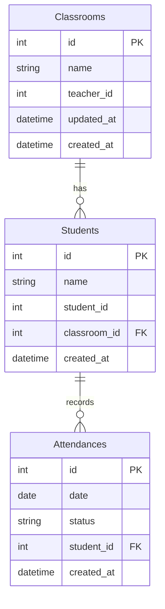
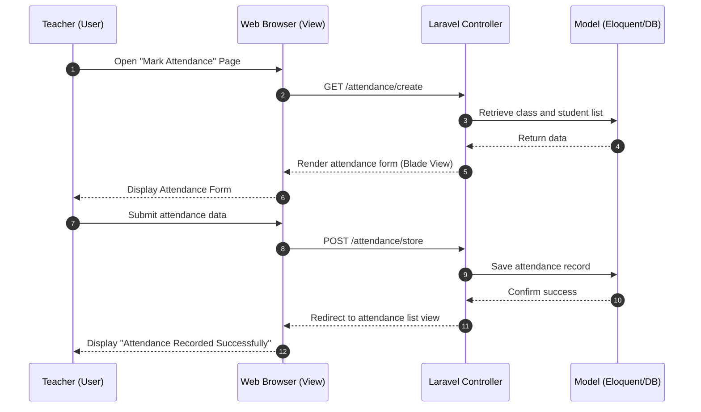

# STUDENT ATTENDANCE MANAGEMENT SYSTEM (SAMS)

**Course:** INFO 3305 Web Application Development  
**Semester:** 1, 2025/2026 — Section 4  
**Submission deadline:** 12/12/2025

## Group Members
- Ahmad Faiz Bin Abdul Karim (2316083)
- Puteri Areefa Aura Binti Kamaruzzaman (2319958)
- Zarith Sofea Binti Hazzarul Hisham (2315270)
- Nor Syazana Binti Mohd Ansar (2319258)
- Nur Maisarah Binti Roslan (2311284)

## Lecturer
Dr. Najhan bin Muhamad Ibrahim

---

## 1. Introduction
The Student Attendance Management System (SAMS) is a web-based application designed to simplify and digitize the process of recording and managing student attendance in educational institutions. Traditionally, attendance is marked manually on paper, whichW can lead to inefficiency, data loss and errors. SAMS, developed using the Laravel Framework, utilizes the Model-View-Controller (MVC) architecture to ensure a structured and scalable system.
Laravel’s technologies such as Eloquent ORM, Blade Template Engine, and Artisan CLI are used to manage data, build responsive user interfaces, and automate backend tasks. This application allows administrators and teachers to manage student records, classes, and attendance efficiently through a user-friendly dashboard accessible from any device.

## 2. Problem Description
The current attendance system faces several challenges. This is because manual attendance tracking is inefficient and error-prone. There is no centralized system for storing attendance records, making reports and analysis difficult. Additionally, the existing methods are not scalable or easily accessible. These challenges highlight the need for modern, automated solutions.

## 3. Objectives
- To automate the attendance recording process, reducing manual errors.
- To store and manage student information systematically using a relational database.
- To allow teachers and administrators to view, update, and generate attendance reports easily.
- To provide real-time insights into student attendance rates for performance analysis.
- To implement Laravel’s MVC structure for better separation of logic, scalability, and maintainability.

## 4. Features and Description

| **Feature**              | **Description**                                                                 |
|---------------------------|---------------------------------------------------------------------------------|
| User Authentication       | Secure login for admin and teachers using Laravel Breeze or Jetstream.         |
| Student Management (CRUD) | Add, view, edit, and delete student records.                                   |
| Class Management          | Create and manage class lists and assign students.                             |
| Attendance Management (CRUD) | Mark daily attendance, edit or delete records, and view history.           |
| Reports and Analytics     | Generate attendance reports by date, class, or student.                        |
| Dashboard Overview        | View summary of total students, classes, and attendance percentage.            |

## 5. Database Design (ERD)

## 6. Sequence Diagram

## 7. References
- Zuanuwar, S. H. (2020). *The Influence Student Attendance Management System on Academic Performance*. Journal of Social Transformation and Education.

## 8. Mock-up
- https://github.com/zarith-website/INFO3305_KOPICAT/blob/main/Mockup%20Log%20In.jpeg?raw=true
- https://github.com/zarith-website/INFO3305_KOPICAT/blob/main/Mockup%20Dashboard.jpeg?raw=true

---
