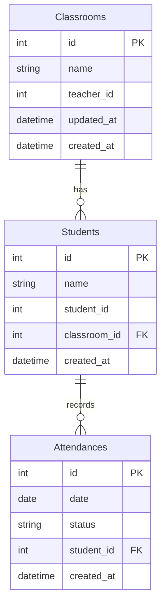
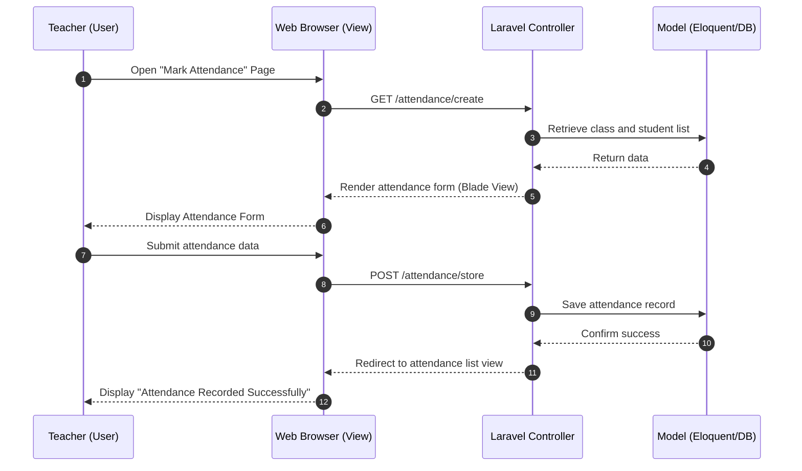

# 📑 Part A: Proposal

# STUDENT ATTENDANCE MANAGEMENT SYSTEM (SAMS)

**Course:** INFO 3305 Web Application Development  
**Semester:** 1, 2025/2026 — Section 4  
**Submission deadline:** 12/12/2025

## Group Members
- Ahmad Faiz Bin Abdul Karim (2316083)
- Puteri Areefa Aura Binti Kamaruzzaman (2319958)
- Zarith Sofea Binti Hazzarul Hisham (2315270)
- Nor Syazana Binti Mohd Ansar (2319258)
- Nur Maisarah Binti Roslan (2311284)

## Lecturer
Dr. Najhan bin Muhamad Ibrahim

---

## 1. Introduction
The Student Attendance Management System (SAMS) is a web-based application designed to simplify and digitize the process of recording and managing student attendance in educational institutions. Traditionally, attendance is marked manually on paper, whichW can lead to inefficiency, data loss and errors. SAMS, developed using the Laravel Framework, utilizes the Model-View-Controller (MVC) architecture to ensure a structured and scalable system.
Laravel’s technologies such as Eloquent ORM, Blade Template Engine, and Artisan CLI are used to manage data, build responsive user interfaces, and automate backend tasks. This application allows administrators and teachers to manage student records, classes, and attendance efficiently through a user-friendly dashboard accessible from any device.

## 2. Problem Description
In many educational institutions, instructors still rely on manual methods such as paper registers or spreadsheets to record attendance. This process is time-consuming, prone to mistakes, and difficult to maintain over time. It also affects the institution’s ability to monitor student participation, which may influence academic performance (Zuanuwar, 2020). The proposed application will be a web-based system accessible through any browser, allowing instructors and administrators to manage attendance more effectively and securely.

The current attendance system faces several challenges. This is because manual attendance tracking is inefficient and error-prone. There is no centralized system for storing attendance records, making reports and analysis difficult. Additionally, the existing methods are not scalable or easily accessible. These challenges highlight the need for modern, automated solutions.

## 3. Objectives
- To automate the attendance recording process, reducing manual errors.
- To store and manage student information systematically using a relational database.
- To allow teachers and administrators to view, update, and generate attendance reports easily.
- To provide real-time insights into student attendance rates for performance analysis.
- To implement Laravel’s MVC structure for better separation of logic, scalability, and maintainability.

## 4. Project Scope
The Student Attendance Management System (SAMS) aims to make the attendance process faster, easier, and more reliable by replacing manual methods with a digital system. The system allows lecturers to take attendance, view student records, and generate reports through an online platform. Administrators can manage users, classes, and attendance data in one place.

The main features include:
- Secure login for admin and lecturers.
- Managing student and class information.
- Recording and editing attendance.
- Generating attendance reports.
- A simple, user-friendly dashboard that works on multiple devices.

Targeted User
SAMS is designed mainly for:
1. Administrators – to manage user accounts, student details, and reports.
2. Lecturers – to take attendance, update records, and monitor attendance trends.
3. Students – in the future, they may be able to view their own attendance records.

Specific Platform
The system will be a web-based application built using the Laravel Framework with a MySQL database. It can run on any browser such as Chrome, 				Firefox, or Edge, and will use HTML, CSS, Blade, and JavaScript for the interface. The system can be hosted locally or on a cloud platform.

## 5. Constraints
The SAMS project has a few limitations that may affect its development and testing:
- Time: The project must be finished within the semester, so there is limited time for testing, adding new features, or improving the design.
- Resources: Development relies on student laptops and free tools. This limits how much data can be stored or processed.
- Budget: There is little to no funding for this project, so free hosting and open-source tools are used instead of paid ones.
- Testing: Real users like lecturers or administrators might not always be available for testing, so the team may have to use demo data.
- Skills: Not all team members are experts in Laravel or web development, so some parts may take longer to complete.
- Internet: Since it’s web-based, the system needs a stable internet connection. Poor connectivity can affect system performance.
- Security: The system stores student data, so extra care is needed to prevent unauthorized access or data loss.
- Maintenance: After deployment, the system may need updates or bug fixes, but ongoing maintenance could be limited due to time and resource constraints.

## 6. Project Stages
The development of SAMS follows the System Development Life Cycle (SDLC) to ensure a structured and organized workflow. The project is divided into the following five stages:

**Phase 1: Requirement Analysis & Planning**
- Identifying the core problems with the current manual attendance system.
- Gathering requirements from potential users (lecturers and admins).
- Defining the project objectives, scope, and feasibility.

**Phase 2: System Design**
- Designing the system architecture based on the MVC (Model-View-Controller) pattern.
- Creating the Entity Relationship Diagram (ERD) to structure the database.
- Designing the User Interface (UI) mockups and the Sequence Diagrams to visualize user interactions.

**Phase 3: Implementation (Development)**

**1. Setting up the Environment**
- Installing Laravel and connecting it to the database so the project is ready to start.

**2. Backend Development**
- Creating the database tables (using migrations) to store student and attendance info, and writing the code (controllers) to handle the logic, like saving or deleting records.

**3. Frontend Development**
- Designing the website pages (like the login screen and dashboard) using Laravel Blade, HTML, and CSS so it looks good and is easy to use.

**4. Integration**
- Connecting the design (Frontend) with the logic (Backend) to make sure the buttons and forms work correctly.

**Phase 4: Testing**
- Unit Testing: Checking individual components (e.g., ensuring a student cannot be added twice).
- User Acceptance Testing (UAT): Verifying that the flow from login to marking attendance works smoothly and meets the objectives defined in Phase 1.
- Debugging errors and optimizing code performance.

**Phase 5: Documentation & Deployment**
- Compiling the final project report, including system documentation and user manuals.
- Preparing the presentation slides for the project defense.
- Final submission of the source code and documentation.

## 7. Gantt Chart

## 8. Significance of the Project
The project will benefit instructors by reducing the paperwork and saving time, administrators by providing centralized and easily accessible data, and institutions by improving data accuracy and enabling performance tracking. Overall, SAMS will enhance efficiency, reliability and scalability in attendance management.

## 8. Summary
In summary, SAMS is a Laravel-based web application that aims to improve the way attendance is recorded and managed in educational institutions. It addresses the inefficiencies of manual tracking and provides a scalable, secure and user-friendly solution that benefits instructors, administrators and institutions.

## 9. References
Zuanuwar, S. H. binti M. (2020). THE INFLUENCE STUDENT ATTENDANCE MANAGEMENT SYSTEM ON ACADEMIC PERFORMANCE. Journal of Social Transformation and Education, 1(1), 26–62. https://doi.org/10.54480/jste.v1i1.3

## Appendix
## Database Design (ERD)

```mermaid
erDiagram
    Classrooms {
        int id PK
        string name
        int teacher_id
        datetime updated_at
        datetime created_at
    }

    Students {
        int id PK
        string name
        int student_id
        int classroom_id FK
        datetime created_at
    }

    Attendances {
        int id PK
        date date
        string status
        int student_id FK
        datetime created_at
    }

    Classrooms ||--o{ Students : "has"
    Students ||--o{ Attendances : "records"
```

## Sequence Diagram

```mermaid
sequenceDiagram
    autonumber

    participant T as Teacher (User)
    participant V as Web Browser (View)
    participant C as Laravel Controller
    participant M as Model (Eloquent/DB)

    T ->> V: Open "Mark Attendance" Page
    V ->> C: GET /attendance/create
    C ->> M: Retrieve class and student list
    M -->> C: Return data
    C -->> V: Render attendance form (Blade View)
    V -->> T: Display Attendance Form

    T ->> V: Submit attendance data
    V ->> C: POST /attendance/store
    C ->> M: Save attendance record
    M -->> C: Confirm success
    C -->> V: Redirect to attendance list view
    V -->> T: Display "Attendance Recorded Successfully"
```
## Mockup
- https://github.com/zarith-website/INFO3305_KOPICAT/blob/main/Proposal%20-%20Mockup%20Log%20In.jpeg
- https://github.com/zarith-website/INFO3305_KOPICAT/blob/main/Proposal%20-%20Mockup%20Dashboard.jpeg

---

# 📑 Part B: Final Report

# STUDENT ATTENDANCE MANAGEMENT SYSTEM (SAMS)

**Course:** INFO 3305 Web Application Development  
**Semester:** 1, 2025/2026 — Section 4  
**Submission deadline:** 08/01/2026

## Group Members
- Ahmad Faiz Bin Abdul Karim (2316083)
- Puteri Areefa Aura Binti Kamaruzzaman (2319958)
- Zarith Sofea Binti Hazzarul Hisham (2315270)
- Nor Syazana Binti Mohd Ansar (2319258)
- Nur Maisarah Binti Roslan (2311284)

## Lecturer
Dr. Najhan bin Muhamad Ibrahim

---

## 1. Introduction
The Student Attendance Management System (SAMS) is a web-based application designed to simplify and digitize the process of recording and managing student attendance in educational institutions. Traditionally, attendance is marked manually on paper, whichW can lead to inefficiency, data loss and errors. SAMS, developed using the Laravel Framework, utilizes the Model-View-Controller (MVC) architecture to ensure a structured and scalable system.
Laravel’s technologies such as Eloquent ORM, Blade Template Engine, and Artisan CLI are used to manage data, build responsive user interfaces, and automate backend tasks. This application allows administrators and teachers to manage student records, classes, and attendance efficiently through a user-friendly dashboard accessible from any device.

## 2. Problem Description
In many educational institutions, instructors still rely on manual methods such as paper registers or spreadsheets to record attendance. This process is time-consuming, prone to mistakes, and difficult to maintain over time. It also affects the institution’s ability to monitor student participation, which may influence academic performance (Zuanuwar, 2020). The proposed application will be a web-based system accessible through any browser, allowing instructors and administrators to manage attendance more effectively and securely.

The current attendance system faces several challenges. This is because manual attendance tracking is inefficient and error-prone. There is no centralized system for storing attendance records, making reports and analysis difficult. Additionally, the existing methods are not scalable or easily accessible. These challenges highlight the need for modern, automated solutions.

## 3. Objectives
- To automate the attendance recording process, reducing manual errors.
- To store and manage student information systematically using a relational database.
- To allow teachers and administrators to view, update, and generate attendance reports easily.
- To provide real-time insights into student attendance rates for performance analysis.
- To implement Laravel’s MVC structure for better separation of logic, scalability, and maintainability.

## 4. Project Scope
The Student Attendance Management System (SAMS) aims to make the attendance process faster, easier, and more reliable by replacing manual methods with a digital system. The system allows lecturers to take attendance, view student records, and generate reports through an online platform. Administrators can manage users, classes, and attendance data in one place.

The main features include:
- Secure login for admin and lecturers.
- Managing student and class information.
- Recording and editing attendance.
- Generating attendance reports.
- A simple, user-friendly dashboard that works on multiple devices.

Targeted User
SAMS is designed mainly for:
1. Administrators – to manage user accounts, student details, and reports.
2. Lecturers – to take attendance, update records, and monitor attendance trends.
3. Students – in the future, they may be able to view their own attendance records.

Specific Platform
The system will be a web-based application built using the Laravel Framework with a MySQL database. It can run on any browser such as Chrome, 				Firefox, or Edge, and will use HTML, CSS, Blade, and JavaScript for the interface. The system can be hosted locally or on a cloud platform.

## 5. Constraints
The SAMS project has a few limitations that may affect its development and testing:
- Time: The project must be finished within the semester, so there is limited time for testing, adding new features, or improving the design.
- Resources: Development relies on student laptops and free tools. This limits how much data can be stored or processed.
- Budget: There is little to no funding for this project, so free hosting and open-source tools are used instead of paid ones.
- Testing: Real users like lecturers or administrators might not always be available for testing, so the team may have to use demo data.
- Skills: Not all team members are experts in Laravel or web development, so some parts may take longer to complete.
- Internet: Since it’s web-based, the system needs a stable internet connection. Poor connectivity can affect system performance.
- Security: The system stores student data, so extra care is needed to prevent unauthorized access or data loss.
- Maintenance: After deployment, the system may need updates or bug fixes, but ongoing maintenance could be limited due to time and resource constraints.

## 6. Project Stages
The development of SAMS follows the System Development Life Cycle (SDLC) to ensure a structured and organized workflow. The project is divided into the following five stages:

**Phase 1: Requirement Analysis & Planning**
- Identifying the core problems with the current manual attendance system.
- Gathering requirements from potential users (lecturers and admins).
- Defining the project objectives, scope, and feasibility.

**Phase 2: System Design**
- Designing the system architecture based on the MVC (Model-View-Controller) pattern.
- Creating the Entity Relationship Diagram (ERD) to structure the database.
- Designing the User Interface (UI) mockups and the Sequence Diagrams to visualize user interactions.

**Phase 3: Implementation (Development)**

**1. Setting up the Environment**
- Installing Laravel and connecting it to the database so the project is ready to start.

**2. Backend Development**
- Creating the database tables (using migrations) to store student and attendance info, and writing the code (controllers) to handle the logic, like saving or deleting records.

**3. Frontend Development**
- Designing the website pages (like the login screen and dashboard) using Laravel Blade, HTML, and CSS so it looks good and is easy to use.

**4. Integration**
- Connecting the design (Frontend) with the logic (Backend) to make sure the buttons and forms work correctly.

**Phase 4: Testing**
- Unit Testing: Checking individual components (e.g., ensuring a student cannot be added twice).
- User Acceptance Testing (UAT): Verifying that the flow from login to marking attendance works smoothly and meets the objectives defined in Phase 1.
- Debugging errors and optimizing code performance.

**Phase 5: Documentation & Deployment**
- Compiling the final project report, including system documentation and user manuals.
- Preparing the presentation slides for the project defense.
- Final submission of the source code and documentation.

## 7. Gantt Chart

## 8. Significance of the Project
The project will benefit instructors by reducing the paperwork and saving time, administrators by providing centralized and easily accessible data, and institutions by improving data accuracy and enabling performance tracking. Overall, SAMS will enhance efficiency, reliability and scalability in attendance management.

## 8. Summary
In summary, SAMS is a Laravel-based web application that aims to improve the way attendance is recorded and managed in educational institutions. It addresses the inefficiencies of manual tracking and provides a scalable, secure and user-friendly solution that benefits instructors, administrators and institutions.

## 9. References
Zuanuwar, S. H. binti M. (2020). THE INFLUENCE STUDENT ATTENDANCE MANAGEMENT SYSTEM ON ACADEMIC PERFORMANCE. Journal of Social Transformation and Education, 1(1), 26–62. https://doi.org/10.54480/jste.v1i1.3

## Appendix
## Database Design (ERD)

```mermaid
erDiagram
    Classrooms {
        int id PK
        string name
        int teacher_id
        datetime updated_at
        datetime created_at
    }

    Students {
        int id PK
        string name
        int student_id
        int classroom_id FK
        datetime created_at
    }

    Attendances {
        int id PK
        date date
        string status
        int student_id FK
        datetime created_at
    }

    Classrooms ||--o{ Students : "has"
    Students ||--o{ Attendances : "records"
```

## Sequence Diagram

```mermaid
sequenceDiagram
    autonumber

    participant T as Teacher (User)
    participant V as Web Browser (View)
    participant C as Laravel Controller
    participant M as Model (Eloquent/DB)

    T ->> V: Open "Mark Attendance" Page
    V ->> C: GET /attendance/create
    C ->> M: Retrieve class and student list
    M -->> C: Return data
    C -->> V: Render attendance form (Blade View)
    V -->> T: Display Attendance Form

    T ->> V: Submit attendance data
    V ->> C: POST /attendance/store
    C ->> M: Save attendance record
    M -->> C: Confirm success
    C -->> V: Redirect to attendance list view
    V -->> T: Display "Attendance Recorded Successfully"
```

## Mockup
- https://github.com/zarith-website/INFO3305_KOPICAT/blob/main/Proposal%20-%20Mockup%20Log%20In.jpeg
- https://github.com/zarith-website/INFO3305_KOPICAT/blob/main/Proposal%20-%20Mockup%20Dashboard.jpeg

## Coding

### Controller
#### 1. AttendanceController.php
https://github.com/zarith-website/INFO3305_KOPICAT/blob/main/Controller%20-%20AttendanceController.php.png 

#### 2. ClassroomController.php
https://github.com/zarith-website/INFO3305_KOPICAT/blob/main/Controller%20-%20ClassroomController.php.png 

#### 3. Controller.php
https://github.com/zarith-website/INFO3305_KOPICAT/blob/main/Controller%20-%20Controller.php.png

#### 4. DashboardController.php
https://github.com/zarith-website/INFO3305_KOPICAT/blob/main/Controller%20-%20DashboardController.php.png

#### 5. StudentController.php
https://github.com/zarith-website/INFO3305_KOPICAT/blob/main/Controller%20-%20StudentController.php.png

### Route
#### 1. web.php
https://github.com/zarith-website/INFO3305_KOPICAT/blob/main/Route%20-%20web.php.png

#### 2. console.php
https://github.com/zarith-website/INFO3305_KOPICAT/blob/main/Route%20-%20console.php.png

#### 3. channels.php
https://github.com/zarith-website/INFO3305_KOPICAT/blob/main/Route%20-%20channels.php.png

#### 4. api.php
https://github.com/zarith-website/INFO3305_KOPICAT/blob/main/Route%20-%20api.php.png

### View
https://github.com/zarith-website/INFO3305_KOPICAT/blob/main/view.png

### Models
#### 1. Attendance.php
https://github.com/zarith-website/INFO3305_KOPICAT/blob/main/Model%20-%20Attendance.php.png

#### 2. Classroom.php
https://github.com/zarith-website/INFO3305_KOPICAT/blob/main/Model%20-%20Classroom.php.png

#### 3. Student.php
https://github.com/zarith-website/INFO3305_KOPICAT/blob/main/Model%20-%20Student.php.png

#### 4. User.php
https://github.com/zarith-website/INFO3305_KOPICAT/blob/main/Model%20-%20User.php.png

### User Authentication
https://github.com/zarith-website/INFO3305_KOPICAT/blob/main/User%20Authentication.png

## User Interface
### 1. Home Page
https://github.com/zarith-website/INFO3305_KOPICAT/blob/main/UI%20-%20Home%20Page.jpeg

### 2. Login Page
https://github.com/zarith-website/INFO3305_KOPICAT/blob/main/UI%20-%20Login%20Page.jpeg

### 3. Register Page
https://github.com/zarith-website/INFO3305_KOPICAT/blob/main/UI%20-%20Register%20Page.jpeg

### 4. Forgot Password Page
https://github.com/zarith-website/INFO3305_KOPICAT/blob/main/UI%20-%20Forgot%20Password%20Page.jpeg

### 5. Dashboard
https://github.com/zarith-website/INFO3305_KOPICAT/blob/main/UI%20-%20Dashboard.jpeg

### 6. Add New Classroom
https://github.com/zarith-website/INFO3305_KOPICAT/blob/main/UI%20-%20Add%20New%20Classroom.jpeg

### 7. Classroom Created
https://github.com/zarith-website/INFO3305_KOPICAT/blob/main/UI%20-%20Classroom%20Created.jpeg

### 8. Classroom
https://github.com/zarith-website/INFO3305_KOPICAT/blob/main/UI%20-%20Classroom.jpeg

### 9. Classroom Student List
https://github.com/zarith-website/INFO3305_KOPICAT/blob/main/UI%20-%20Classroom%20Student%20List.jpeg

### 10. Add New Student
https://github.com/zarith-website/INFO3305_KOPICAT/blob/main/UI%20-%20Add%20New%20Student.jpeg

### 11. Search
https://github.com/zarith-website/INFO3305_KOPICAT/blob/main/UI%20-%20Search.jpeg

### 12.Dashboard after Adding Students
https://github.com/zarith-website/INFO3305_KOPICAT/blob/main/UI%20-%20Dashboard%20after%20Adding%20Student.jpeg

---
